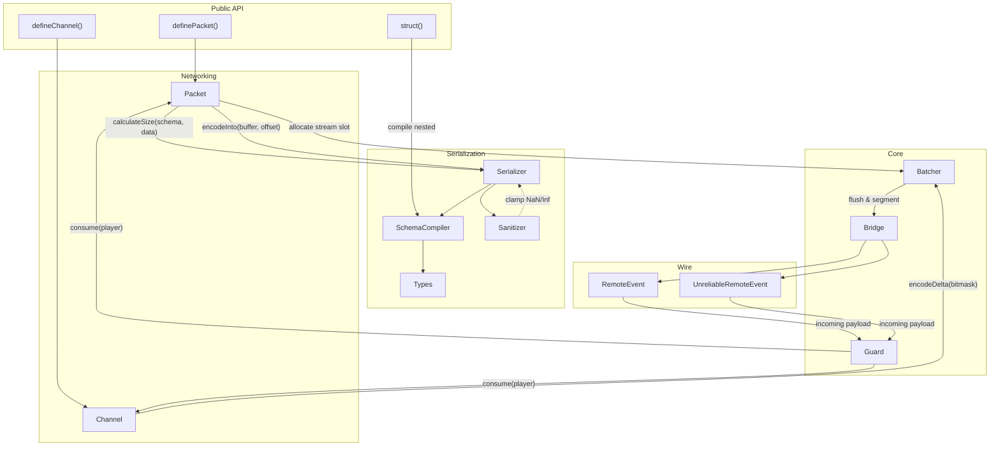

<div align="center">


# Sat·Set


</div>

**sat·set** /sat-sèt/ *adjective (slang)*: Indonesian colloquialism for being rapid, efficient, and quick to act.

> *"Sat set, sampai."* means "Swiftly done."

Satset is a buffer-backed networking library for [Roblox](https://roblox.com). It handles packet serialization, batching, rate limiting, and state synchronization. The public API covers stateless events (Packets) and delta-compressed state (Channels).

Satset keeps the send path in Luau `buffer` objects where possible. Packet listeners receive decoded tables, and channel subscribers receive reconstructed state tables.

# Performance Benchmarks

The [benchmark suite](benchmark/Benchmarks.md) compares Satset with native Roblox remotes and community networking libraries. It sends 200 events per frame for 10 seconds per payload. The tables report Roblox `Stats.DataSendKbps` p50 values normalized to a 60 FPS baseline.

## Batching Profiles

The latest benchmark uses two Satset profiles:

| Payload | Default normalized | Latency normalized | Default commits/frame | Latency commits/frame |
| :--- | ---: | ---: | ---: | ---: |
| Vectors | 118.13 | 38.84 | 3 | 1 |
| Booleans | 10.43 | 10.38 | 1 | 1 |
| Mixed | 4.29 | 4.31 | 1 | 1 |
| Entities | 117.53 | 39.15 | 3 | 1 |
| Strings | 899.63 | 96.37 | 8 | 1 |
| SingleValue | 2.39 | 2.38 | 1 | 1 |

> [!NOTE]
> `Normalized` is `Stats.DataSendKbps` adjusted to 60 FPS. The default benchmark profile uses `reliableThreshold = 60000` and `maxPacketsPerFrame = 20`. The latency profile uses `reliableThreshold = 0` and `maxPacketsPerFrame = 0`.

Detailed methodology and raw data are in the [Benchmarks Report](benchmark/Benchmarks.md).

# Documentation

Technical documentation is available in the `docs/` directory:

- **[Architecture & Getting Started](docs/guide/getting-started.md)**: High-level overview and initialization.
- **[API Reference](docs/api/satset.md)**: Detailed breakdown of the `Satset` namespace.
- **[Development Patterns](docs/guide/development-patterns.md)**: Design rules and performance constraints.
- **[Security & Guard](docs/guide/security.md)**: Documentation on the token bucket rate limiting implementation.
- **[Serialization Types](docs/api/types.md)**: Available data types for buffer-backed schemas.

# Contributing

Contributions are welcome! Please review our **[Contribution Guide](CONTRIBUTING.md)** and **[Development Patterns](docs/guide/development-patterns.md)** before submitting a pull request.

# Features

## Hybrid Networking Engine

Satset provides two distinct communication modes:

- **Packets (Stateless)**: For one-off events like character actions or effects. These are batched automatically every frame to minimize RemoteEvent overhead.
- **Channels (Stateful)**: The core state synchronization engine. It tracks changes to a defined schema and transmits only the dirty fields (deltas) using bitmask-based compression.

## Implementation Details

- **Buffer-backed batching**: Outgoing payloads are encoded into Luau buffers and committed as exact-size buffers before transport.
- **Nested Structs**: Use `Satset.struct(schema)` to create reusable, composable type objects for complex nested schemas.
- **Readable Type Names**: Provides human-readable aliases (`string`, `uint8`, `float64`, etc.) alongside shorthand forms for cleaner, more self-documenting schemas.
- **Packet dispatch**: Incoming batches are decoded in place. Each packet listener receives a decoded table.
- **Built-in Security**: Relies on Luau's native buffer bounds checks. Payload errors are caught via `pcall` before they reach game code.
- **Buffer Safety**: Dynamic data (strings/arrays) is capped relative to the physical buffer size to prevent memory-related issues.
- **Sanitized Floats**: Floating-point types (`f32`, `f64`, `Vector3`, etc.) are clamped to 0 if they are `NaN` or `±Infinity` to prevent state corruption.
- **Header Stripping**: Automatically identifies fixed-size schemas and omits size headers when possible to reduce protocol overhead.
- **Batch Segmentation**: Reliable batches split at `reliableThreshold`. Unreliable batches split around the configured unreliable threshold, which defaults to 900 bytes.
- **Guard**: Built-in server-side rate limiting using a token bucket algorithm to prevent spam.

# Architecture

The following diagram shows how data flows through Satset's internal modules, from the public API down to the wire.



For a detailed step-by-step walkthrough of a packet's lifecycle, see the [Architecture Guide](docs/guide/architecture.md).

# Usage

## Installation

Add Satset to your `wally.toml`:

```toml
Satset = "protheeuz/satset@0.3.3"
```

Then run `wally install`.

## Initialization

Satset must be started once on both the **Server** and **Client** before defining any packets or channels.

```luau
-- In your main Server/Client entry point
local ReplicatedStorage = game:GetService("ReplicatedStorage")
local Satset = require(ReplicatedStorage.Packages.Satset)
 
Satset.start({
    guard = {
        maxTokens = 60,
        refillRate = 30,
    },
    batching = {
        reliableThreshold = 60000, -- Split reliable batches above 60 KB
        maxPacketsPerFrame = 0, -- Send all ready batches each frame
    }
})
```

## Packets (Stateless Events)

Packets are for "fire-and-forget" events like combat hits, chat messages, or UI triggers.

**Shared Definition:**

```luau
-- ReplicatedStorage/Networking/Packets.luau
local ReplicatedStorage = game:GetService("ReplicatedStorage")
local Satset = require(ReplicatedStorage.Packages.Satset)
local Types = Satset.Types
 
return {
    Damage = Satset.definePacket({
        name = "Damage",
        schema = {
            targetId = Types.u32,
            amount = Types.u16,
            critical = Types.bool
        },
        reliable = true
    })
}
```

**Server Usage:**

```luau
local Packets = require(path.to.Shared.Packets)
 
-- Sending to specific client
Packets.Damage:fireClient(player, { targetId = 123, amount = 50, critical = true })
 
-- Listening to client events
Packets.Damage:listen(function(data, sender)
    print(sender.Name .. " dealt " .. data.amount .. " damage!")
end)
```

**Client Usage:**

```luau
local Packets = require(path.to.Shared.Packets)
 
-- Sending to server
Packets.Damage:fireServer({ targetId = 456, amount = 25, critical = false })
 
-- Listening to server events
Packets.Damage:listen(function(data)
    print("Took " .. data.amount .. " damage!")
end)
```

## Channels (Stateful Synchronization)

Channels are for data that has "state" (like health or positions). They use **delta-compression** and are much more efficient than packets for frequent updates.

**Shared Definition:**

```luau
-- ReplicatedStorage/Networking/Channels.luau
local ReplicatedStorage = game:GetService("ReplicatedStorage")
local Satset = require(ReplicatedStorage.Packages.Satset)
local Types = Satset.Types
 
return {
    PlayerState = Satset.defineChannel({
        name = "PlayerState",
        schema = {
            health = Types.u8,
            position = Types.Vector3Quantized(2048)
        },
        unreliable = true,
        resyncInterval = 5 -- Periodic keyframe to prevent drift
    })
}
```

**Server Usage:**

```luau
local Channels = require(path.to.Shared.Channels)
 
-- Create an entity instance for a player
local entity = Channels.PlayerState:create(player.UserId, {
    health = 100,
    position = Vector3.new(0, 5, 0)
})
 
-- Update state (only changed fields are transmitted)
entity:set("health", 85) 
```

**Client Usage:**

```luau
local Channels = require(path.to.Shared.Channels)
 
-- Subscribe to state changes
Channels.PlayerState:subscribe(function(entityId, state)
    print("Entity", entityId, "updated. Health:", state.health)
end)
```

# License

Satset is distributed under the terms of the [MIT License](LICENSE).

When Satset is integrated into external projects, we ask that you honor the license agreement and include Satset attribution into the user-facing product documentation.
