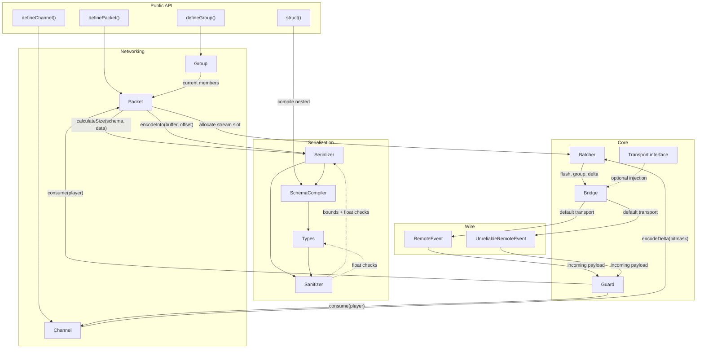

<div align="center">


# Sat·Set


</div>

**sat·set** /sat-sèt/ *adjective (slang)*: Indonesian slang for doing something quickly.

> *"Sat set, sampai."* means "Swiftly done."

Satset is a buffer-backed networking library for [Roblox](https://roblox.com). It handles packet serialization, batching, rate limiting, and state sync. The public API covers stateless events (Packets) and bitmask-tracked state (Channels). Packets can also target explicit server-owned Groups.

Satset keeps packet data in Luau `buffer` objects until the API boundary. Packet listeners receive decoded tables. Channel subscribers receive reconstructed state tables.

# Performance Benchmarks

The benchmark suite in `benchmarks/` compares Satset with native Roblox remotes and community networking libraries. Each row runs 600 frames with 200 events per frame. The report includes normalized bandwidth, visible GC movement, submitted wire bytes, workload duration, and drain time.

## Latest Full Run

The latest report has separate static and moving runs. Static repeats one payload. Moving changes values by frame and event slot.

| Variant | **Satset** bandwidth wins | Other winner |
| :--- | ---: | :--- |
| Static | 5 / 6 | Warp leads Entities |
| Moving | 5 / 6 | Packet leads Strings |

Satset completed every row at 120,000 sent and received events. The moving run is the better reference for changing game state; the static run shows the best case for repeated-data compression.

Read the full [benchmark report](benchmarks/Benchmarks.md) for per-library GC, wire shape, duration, drain, FPS, and completion data. Raw Studio output is in [moving-benchmark.json](benchmarks/moving-benchmark.json) and [static-benchmark.json](benchmarks/static-benchmark.json).

# Documentation

Technical documentation lives in the `docs/` directory:

- **[Architecture & Getting Started](docs/guide/getting-started.md)**: High-level overview and initialization.
- **[API Reference](docs/api/satset.md)**: `Satset` namespace, packets, groups, channels, guards, and types.
- **[Development Patterns](docs/guide/development-patterns.md)**: Design rules and performance constraints.
- **[Security & Guard](docs/guide/security.md)**: Documentation on the token bucket rate limiting implementation.
- **[Serialization Types](docs/api/types.md)**: Available data types for buffer-backed schemas.

# Contributing

Before opening a pull request, read the **[Contribution Guide](CONTRIBUTING.md)** and **[Development Patterns](docs/guide/development-patterns.md)**.

Run the transport contract test with `lune run tests/transport.luau`.

# Features

## Hybrid Networking Engine

Satset has two public networking surfaces:

- **Packets (Stateless)**: One-off events like character actions or effects. Satset batches them every frame.
- **Channels (Stateful)**: State sync for fixed-size schemas. Channels write state into a buffer, mark dirty fields with a bitmask, and send changed bytes between keyframes.

Groups are a server-owned audience for Packets. They do not change the Packet
or Channel model.

## Implementation Details

- **Buffer-backed batching**: Outgoing payloads are encoded into Luau buffers and committed as exact-size buffers before transport.
- **Reliable run grouping**: Same-packet reliable runs share one packet id and one run count.
- **Adaptive reliable delta**: Direct reliable traffic tracks the previous same-size batch. General payloads use XOR, text can stay raw when XOR is not useful, and eligible bitpacked payloads can transpose their delta bytes. Broadcast reliable traffic stays raw.
- **Nested structs**: Use `Satset.struct(schema)` to build reusable type objects.
- **ByteNet-style aliases**: `string`, `uint8`, `float64`, and related names map to Satset's shorthand types.
- **Packet dispatch**: Incoming batches are decoded in place. Each packet listener receives a decoded table.
- **Bounds checks**: Payload errors are caught through protected calls before game code receives data.
- **Buffer safety**: Dynamic data, such as strings and arrays, is capped against the physical buffer size.
- **Float sanitization**: Floating-point types (`f32`, `f64`, `Vector3`, etc.) clamp `NaN` and `±Infinity` to `0`.
- **Header stripping**: Fixed-size schemas omit per-payload size headers.
- **Guard**: Built-in server-side rate limiting through a token bucket.

# Architecture

The following diagram shows how data flows through Satset's internal modules, from the public API down to the wire.



For a detailed step-by-step walkthrough of a packet's lifecycle, see the [Architecture Guide](docs/guide/architecture.md).

# Usage

## Installation

Add Satset to your `wally.toml`:

```toml
Satset = "protheeuz/satset@0.4.2"
```

Then run `wally install`.

## Initialization

Satset must be started once on both the **Server** and **Client** before defining
packets, groups, or channels.

```luau
-- In your main Server/Client entry point
local ReplicatedStorage = game:GetService("ReplicatedStorage")
local Satset = require(ReplicatedStorage.Packages.Satset)
 
Satset.start({
    guard = {
        maxTokens = 1000,
        refillRate = 500,
        studioBypass = true,
    },
    batching = {
        reliableThreshold = 0, -- Commit reliable traffic at the frame flush
        unreliableThreshold = 900, -- Keep UnreliableRemoteEvent payloads small
        maxPacketsPerFrame = 0, -- No per-frame send cap
    }
})
```

## Packets (Stateless Events)

Packets are for "fire-and-forget" events like combat hits, chat messages, or UI triggers.

**Shared Definition:**

```luau
-- ReplicatedStorage/Networking/Packets.luau
local ReplicatedStorage = game:GetService("ReplicatedStorage")
local Satset = require(ReplicatedStorage.Packages.Satset)
local Types = Satset.Types
 
return {
    Damage = Satset.definePacket({
        name = "Damage",
        schema = {
            targetId = Types.u32,
            amount = Types.u16,
            critical = Types.bool
        },
        reliable = true
    })
}
```

**Server Usage:**

```luau
local Satset = require(game:GetService("ReplicatedStorage").Packages.Satset)
local Packets = require(path.to.Shared.Packets)
 
-- Sending to specific client
Packets.Damage:fireClient(player, { targetId = 123, amount = 50, critical = true })

-- One encode, then fanout through each member's packet stream
local RedTeam = Satset.defineGroup("RedTeam")
RedTeam:add(player)
Packets.Damage:fireGroup(RedTeam, { targetId = 123, amount = 50, critical = true })
 
-- Listening to client events
Packets.Damage:listenServer(function(player, data)
    print(player.Name .. " dealt " .. data.amount .. " damage!")
end)
```

**Client Usage:**

```luau
local Packets = require(path.to.Shared.Packets)
 
-- Sending to server
Packets.Damage:fireServer({ targetId = 456, amount = 25, critical = false })
 
-- Listening to server events
Packets.Damage:listen(function(data)
    print("Took " .. data.amount .. " damage!")
end)
```

## Channels (Stateful Sync)

Channels are for data that has state, such as health or positions. The first flush sends a full keyframe. Later flushes send only fields marked by the dirty bitmask.

**Shared Definition:**

```luau
-- ReplicatedStorage/Networking/Channels.luau
local ReplicatedStorage = game:GetService("ReplicatedStorage")
local Satset = require(ReplicatedStorage.Packages.Satset)
local Types = Satset.Types
 
return {
    PlayerState = Satset.defineChannel({
        name = "PlayerState",
        schema = {
            health = Types.u8,
            position = Types.Vector3Quantized(2048)
        },
        unreliable = true,
        resyncInterval = 5 -- Periodic keyframe after dropped unreliable updates
    })
}
```

**Server Usage:**

```luau
local Channels = require(path.to.Shared.Channels)
 
-- Create state for a player
local entity = Channels.PlayerState:create(player.UserId, {
    health = 100,
    position = Vector3.new(0, 5, 0)
})
 
-- Only changed fields are sent on the next flush
entity:set("health", 85) 
```

**Client Usage:**

```luau
local Channels = require(path.to.Shared.Channels)
 
Channels.PlayerState:subscribe(function(entityId, state)
    print("Entity", entityId, "updated. Health:", state.health)
end)
```

# License

Satset is distributed under the terms of the [MIT License](LICENSE).

When Satset is integrated into external projects, we ask that you honor the license agreement and include Satset attribution into the user-facing product documentation.
