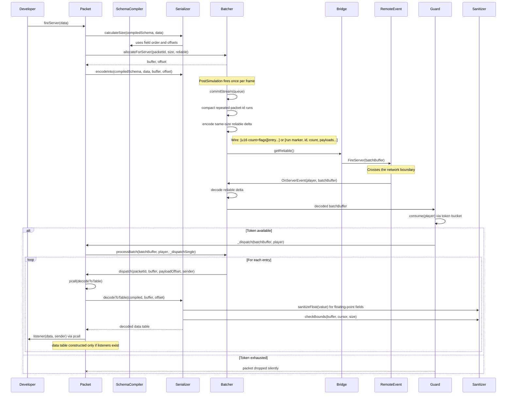
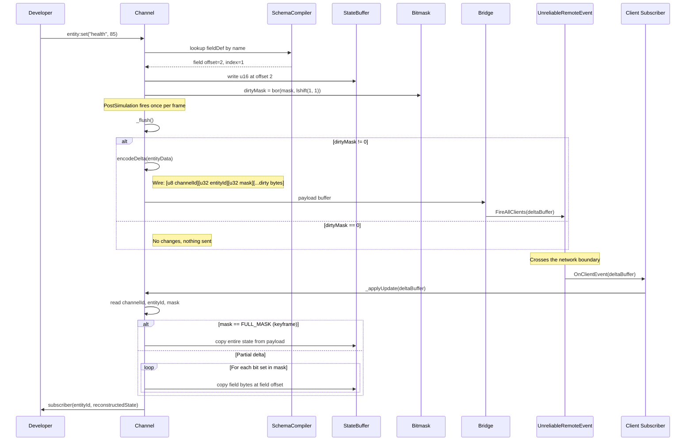

# Architecture

This document describes Satset's internal data flow. It follows packets and channels from the public API call through serialization, batching, transport, validation, and dispatch.

For a high-level overview, see the [data flow diagram in the README](../../README.md#architecture).

## Module Overview

Satset is organized into four layers:

| Layer | Modules | Responsibility |
| :--- | :--- | :--- |
| **Networking** | `Packet`, `Channel` | Public-facing API. Handles definition, dispatch, and listener registration. |
| **Serialization** | `SchemaCompiler`, `Serializer`, `Sanitizer`, `Types` | Converts Luau tables into flat binary buffers and back. |
| **Core** | `Batcher`, `Guard`, `Bridge` | Frame-level batching, rate limiting, and RemoteEvent management. |
| **Transport** | `RemoteEvent`, `UnreliableRemoteEvent` | Roblox-native wire protocol. |

## Packet Lifecycle (Stateless)

The following diagram traces a single reliable `fireServer()` call from the client to the server.



### Wire Format (Reliable Batch)

The reliable batch header stores a 14-bit item count plus two flags in the high bits:

- `0x4000`: the batch is tracked for reliable delta state;
- `0x8000`: the payload after the header is XOR delta data;
- `0x3FFF`: count mask.

```luau
[u16 packetCountAndFlags]
  [u8 packetId][u16 payloadSize][...payload bytes] (Variable size)
  [u8 packetId][...payload bytes] (Fixed size - size header omitted)
  ...
```

When a reliable batch contains repeated entries with the same packet id, Satset can compact that run:

```luau
[u8 0][u8 packetId][u16 runCount][payload][payload]...
```

The run marker is `0`, which is reserved internally. Fixed-size payloads can be split by the compiled packet size. Variable-size payloads are decoded by the packet serializer, which returns the consumed byte count to the batcher.

### Wire Format (Unreliable Batch)

Unreliable batches include a sequence number for stale packet detection. If the batch exceeds 900 bytes, Satset commits the current stream and starts a new sub-batch with its own sequence number.

```luau
[u16 sequenceNumber][u16 packetCount]
  [u8 packetId][u16 payloadSize][...payload bytes] (Variable)
  [u8 packetId][...payload bytes] (Fixed)
  ...
```

## Channel Lifecycle (Stateful)

Channels handle state sync for fixed-size schemas. A channel writes entity state into a buffer, marks changed fields in a 32-bit bitmask, and sends the dirty bytes during `PostSimulation`.



### Wire Format (Channel Delta)

```luau
[u8 channelId][u32 entityId][u32 dirtyMask][...dirty field bytes]
```

When `dirtyMask == 0xFFFFFFFF` (all bits set), the payload contains the full state buffer. This is used for the first sync and periodic resyncs (controlled by `resyncInterval`).

### Resync Mechanism

Channels periodically send a full keyframe to prevent client-side state drift caused by dropped unreliable packets. The default interval is 5 seconds, configurable via `resyncInterval` in the channel definition. During a resync frame, all entities in the channel receive a full state payload regardless of their dirty mask.

## Validation Pipeline

Satset validates incoming data before it reaches a game listener:

1. **Out-of-bounds shielding (`pcall`)**: Packet decoding runs inside a protected call. If a payload forces a read past the end of the buffer, the VM throws and Satset drops the packet.
2. **Allocation caps**: Variable-length types, such as arrays, strings, and maps, cap allocations against the remaining bytes in the payload.
3. **Float sanitization (`Sanitizer.sanitizeFloat`)**: Floating-point fields (`f32`, `f64`, `Vector3`, etc.) clamp `NaN` and `Infinity` to `0`.
4. **Schema bounds checks (`Sanitizer.checkBounds`)**: Fixed-size schema reads check that enough bytes remain before reading.

## Batching

Satset's batching engine is configured through the `batching` table in `Satset.start()`.

### Runtime Defaults

The current default commits reliable traffic at the frame flush. It does not split reliable traffic by size unless you opt into a positive `reliableThreshold`.

```luau
batching = {
    reliableThreshold = 0, -- Commit reliable traffic at frame flush
    unreliableThreshold = 900, -- Split unreliable traffic around the safe payload size
    maxPacketsPerFrame = 0, -- No per-frame send cap
}
```

`maxPacketsPerFrame` caps how many committed batches each queue can send in one frame. A value of `0` means no cap. The benchmark uses the defaults above.
